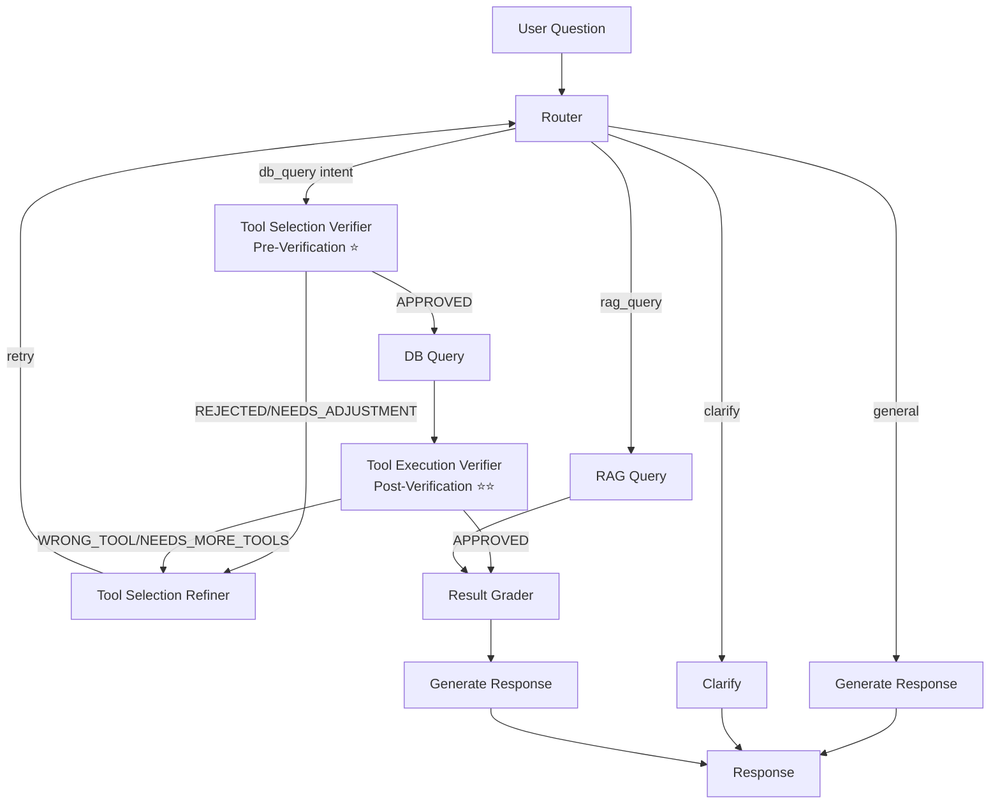

# การ Implement: Tool Execution Verifier (Phase 2)

**วันที่:** 2026-02-12  
**สถานะ:** ✅ Completed

---

## สรุป

ได้ implement **Phase 2: Tool Execution Verifier (Post-Verification)** สำเร็จแล้ว

### ไฟล์ที่สร้าง/แก้ไข

1. ✅ **`backend/app/orchestrator/nodes/tool_execution_verifier.py`** (NEW)
   - ตรวจสอบผลลัพธ์หลังรัน tools
   - ใช้ LLM เพื่อตรวจสอบว่าผลลัพธ์ตอบคำถามได้หรือไม่
   - Return: `APPROVED`, `WRONG_TOOL`, หรือ `NEEDS_MORE_TOOLS`

2. ✅ **`backend/app/utils/system_prompt.py`** (UPDATED)
   - เพิ่ม `get_tool_execution_verifier_prompt()` function
   - System prompt สำหรับ tool execution verifier

3. ✅ **`backend/app/orchestrator/state.py`** (UPDATED)
   - เพิ่ม fields สำหรับ execution verification:
     - `execution_verification_status`: "APPROVED" | "WRONG_TOOL" | "NEEDS_MORE_TOOLS"
     - `execution_verification_reason`: คำอธิบาย
     - `execution_verification_suggested_changes`: คำแนะนำการแก้ไข
     - `execution_verification_retry_count`: จำนวนครั้งที่ retry
     - `max_execution_verification_retries`: จำนวนครั้งสูงสุด (default: 2)

4. ✅ **`backend/app/orchestrator/graph.py`** (UPDATED)
   - เพิ่ม node: `tool_execution_verifier`
   - อัพเดท edges:
     - `db_query` → `tool_execution_verifier` (ตรวจสอบหลังรัน)
     - `tool_execution_verifier` → `result_grader` (ถ้า APPROVED)
     - `tool_execution_verifier` → `tool_selection_refiner` (ถ้า WRONG_TOOL/NEEDS_MORE_TOOLS)

5. ✅ **`backend/app/orchestrator/nodes/tool_selection_refiner.py`** (UPDATED)
   - รองรับทั้ง selection verification และ execution verification
   - สามารถแก้ไข tools จากทั้งสองแหล่ง

---

## Flow ใหม่ (Hybrid Approach - Complete)



---

## การทำงาน

### 1. Router เลือก Tools
- Router วิเคราะห์ intent และเลือก tools
- ส่งไปที่ Tool Selection Verifier (Pre-Verification)

### 2. Tool Selection Verifier (Pre-Verification) ⭐
- ตรวจสอบว่า tools ที่เลือกเหมาะสมกับคำถามหรือไม่
- ✅ APPROVED → ไปรัน tools
- ❌ REJECTED/⚠️ NEEDS_ADJUSTMENT → Tool Selection Refiner → Router (retry)

### 3. DB Query
- รัน tools ที่ผ่านการตรวจสอบแล้ว

### 4. Tool Execution Verifier (Post-Verification) ⭐⭐ NEW
- ตรวจสอบว่าผลลัพธ์ตอบคำถามได้หรือไม่
- ตรวจสอบว่า tool ที่ใช้เหมาะสมหรือไม่
- Return:
  - ✅ **APPROVED**: ไป Result Grader
  - ❌ **WRONG_TOOL**: Tool ไม่เหมาะสม → Tool Selection Refiner → Router (retry)
  - ⚠️ **NEEDS_MORE_TOOLS**: ต้องใช้ tools เพิ่มเติม → Tool Selection Refiner → Router (retry)

### 5. Result Grader
- ตรวจสอบคุณภาพข้อมูล (sufficient/insufficient/empty/error)

### 6. Generate Response
- สร้างคำตอบจากผลลัพธ์

---

## ตัวอย่างการทำงาน

### ตัวอย่างที่ 1: ผลลัพธ์ตอบคำถามได้

**คำถาม:** "ยอดขายวันนี้"

**Pre-Verification:**
- Router เลือก: `get_sales_closed` ✅
- Tool Selection Verifier: ✅ APPROVED
- → DB Query

**Post-Verification:**
- ผลลัพธ์: มี salesLeads พร้อม totalSalesValue
- Tool Execution Verifier: ✅ APPROVED
- เหตุผล: "ผลลัพธ์มีข้อมูลยอดขายวันนี้ครบถ้วน สามารถตอบคำถามได้"
- → Result Grader → Generate Response

### ตัวอย่างที่ 2: Tool ไม่เหมาะสม (ตรวจพบหลังรัน)

**คำถาม:** "ยอดขายที่ปิดแล้ววันนี้"

**Pre-Verification:**
- Router เลือก: `search_leads` with status='ปิดการขาย' ⚠️
- Tool Selection Verifier: ✅ APPROVED (อาจตรวจไม่เจอ)
- → DB Query

**Post-Verification:**
- ผลลัพธ์: มี leads แต่ไม่มียอดขาย (totalSalesValue)
- Tool Execution Verifier: ❌ WRONG_TOOL
- เหตุผล: "คำถามเกี่ยวกับยอดขายที่ปิดแล้ว ควรใช้ get_sales_closed ไม่ใช่ search_leads"
- คำแนะนำ: ใช้ `get_sales_closed` แทน
- → Tool Selection Refiner → Router (retry)

**Router เลือกใหม่:** `get_sales_closed` ✅

**Pre-Verification:**
- ✅ APPROVED
- → DB Query

**Post-Verification:**
- ✅ APPROVED
- → Result Grader → Generate Response

### ตัวอย่างที่ 3: ต้องใช้ tools เพิ่มเติม

**คำถาม:** "ยอดขายแยกตามเดือน"

**Pre-Verification:**
- Router เลือก: `get_sales_closed` with date_from=2026-01-01, date_to=2026-02-12 ⚠️
- Tool Selection Verifier: ✅ APPROVED (อาจตรวจไม่เจอ)
- → DB Query

**Post-Verification:**
- ผลลัพธ์: มียอดรวมแต่ไม่แยกรายเดือน
- Tool Execution Verifier: ⚠️ NEEDS_MORE_TOOLS
- เหตุผล: "คำถามต้องการแยกรายเดือน ต้องเรียก get_sales_closed หลายครั้ง ครั้งละ 1 เดือน"
- คำแนะนำ: เรียก `get_sales_closed` 3 ครั้ง (แต่ละเดือน)
- → Tool Selection Refiner → Router (retry)

**Router เลือกใหม่:** `get_sales_closed` 3 ครั้ง ✅

**Pre-Verification:**
- ✅ APPROVED
- → DB Query

**Post-Verification:**
- ✅ APPROVED
- → Result Grader → Generate Response

### ตัวอย่างที่ 4: ข้อมูลว่างเปล่า (ถูกต้อง)

**คำถาม:** "ยอดขายวันนี้"

**Pre-Verification:**
- Router เลือก: `get_sales_closed` ✅
- Tool Selection Verifier: ✅ APPROVED
- → DB Query

**Post-Verification:**
- ผลลัพธ์: success=true แต่ salesLeads = [] (ว่างเปล่า)
- Tool Execution Verifier: ✅ APPROVED
- เหตุผล: "Tool ถูกต้อง ผลลัพธ์ว่างเปล่าแสดงว่าไม่มียอดขายวันนี้ - นี่คือคำตอบที่ถูกต้อง"
- → Result Grader → Generate Response

---

## ความแตกต่างระหว่าง Pre-Verification และ Post-Verification

| Aspect | Pre-Verification | Post-Verification |
|--------|-----------------|-------------------|
| **เวลา** | ก่อนรัน tools | หลังรัน tools |
| **ตรวจสอบ** | Tool selection และ parameters | ผลลัพธ์และความเหมาะสม |
| **ข้อดี** | ประหยัดเวลาและ API calls | ตรวจสอบจากผลลัพธ์จริง |
| **ข้อเสีย** | อาจตรวจไม่เจอบางกรณี | ต้องรอผลลัพธ์ก่อน |
| **Status** | APPROVED, REJECTED, NEEDS_ADJUSTMENT | APPROVED, WRONG_TOOL, NEEDS_MORE_TOOLS |

---

## Configuration

### Max Execution Verification Retries
- Default: `max_execution_verification_retries = 2`
- ถ้า retry เกินจำนวนนี้ จะ approve อัตโนมัติเพื่อไม่ให้ blocking

### Temperature
- Verifier ใช้ `temperature=0.3` เพื่อความสม่ำเสมอในการตรวจสอบ

---

## Error Handling

1. **LLM Error**: ถ้า LLM error จะ approve อัตโนมัติ (ไม่ให้ blocking)
2. **JSON Parse Error**: ถ้า parse JSON ไม่ได้ จะ approve อัตโนมัติ
3. **Max Retries**: ถ้า retry เกินจำนวน จะ approve อัตโนมัติ
4. **No Results**: ถ้าไม่มี tool results จะ skip verification

---

## Integration with Tool Selection Refiner

Tool Selection Refiner รองรับทั้งสองแหล่ง:
- **Selection Verification**: จาก Tool Selection Verifier (Pre-Verification)
- **Execution Verification**: จาก Tool Execution Verifier (Post-Verification)

Refiner จะตรวจสอบทั้งสองแหล่งและใช้ feedback ที่เหมาะสม

---

## Testing Checklist

- [ ] Test: ผลลัพธ์ตอบคำถามได้ → APPROVED
- [ ] Test: Tool ไม่เหมาะสม → WRONG_TOOL → Refiner → Router retry
- [ ] Test: ต้องใช้ tools เพิ่มเติม → NEEDS_MORE_TOOLS → Refiner → Router retry
- [ ] Test: ข้อมูลว่างเปล่า (tool ถูกต้อง) → APPROVED
- [ ] Test: No tools executed → APPROVED (skip verification)
- [ ] Test: Max retries → APPROVED (auto-approve)
- [ ] Test: LLM error → APPROVED (fallback)

---

## สรุป Phase 1 + Phase 2 (Hybrid Approach)

### Flow Complete

```
User Question
    ↓
Router
    ↓
🔍 Tool Selection Verifier (Pre-Verification) ⭐
    ├─ ✅ APPROVED → DB Query
    └─ ❌ REJECTED/⚠️ NEEDS_ADJUSTMENT → Refiner → Router
    ↓
DB Query
    ↓
🔍 Tool Execution Verifier (Post-Verification) ⭐⭐
    ├─ ✅ APPROVED → Result Grader
    └─ ❌ WRONG_TOOL/⚠️ NEEDS_MORE_TOOLS → Refiner → Router
    ↓
Result Grader
    ↓
Generate Response
```

### ข้อดีของ Hybrid Approach

1. ✅ **ตรวจสอบ 2 ชั้น** - ก่อนและหลังรัน
2. ✅ **ถูกต้องสูงสุด** - ป้องกันการเลือก tool ผิดตั้งแต่ต้น + ตรวจสอบผลลัพธ์จริง
3. ✅ **มีประสิทธิภาพ** - Pre-verification ประหยัดเวลา
4. ✅ **ยืดหยุ่น** - แก้ไขได้ทั้งก่อนและหลังรัน

---

## Files Summary

```
backend/app/orchestrator/
├── nodes/
│   ├── tool_selection_verifier.py      (Phase 1) ⭐
│   ├── tool_execution_verifier.py      (Phase 2) ⭐⭐ NEW
│   ├── tool_selection_refiner.py       (Updated) ⭐
│   ├── db_query.py
│   ├── result_grader.py
│   └── ...
├── graph.py                            (UPDATED) ⭐⭐
└── state.py                            (UPDATED) ⭐⭐

backend/app/utils/
└── system_prompt.py                    (UPDATED) ⭐⭐
```

---

*อ้างอิง:*
- `docs/TOOL_SELECTION_VERIFICATION_ANALYSIS.md` - การวิเคราะห์แนวทาง
- `docs/TOOL_VERIFICATION_SUMMARY_TH.md` - สรุปภาษาไทย
- `docs/TOOL_SELECTION_VERIFIER_IMPLEMENTATION.md` - Phase 1 Implementation
