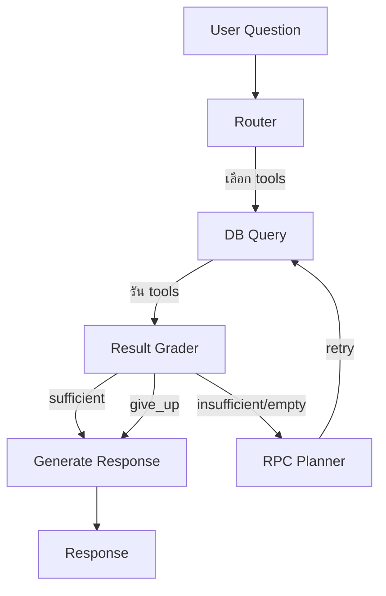
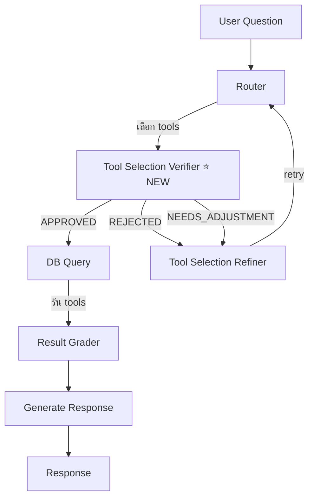
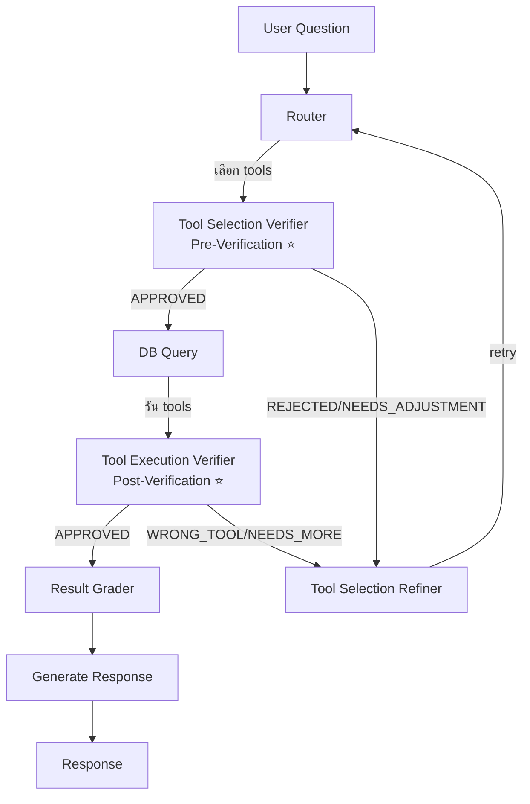

# การวิเคราะห์: กระบวนการตรวจสอบการเลือก Tools/Functions

**วันที่:** 2026-02-12  
**บริบท:** ปัญหา AI Agent เลือก tools/functions ผิด ต้องการกระบวนการตรวจสอบหรือ AI Agent อีกตัวมาทำการตรวจสอบ

---

## 1. Flow ปัจจุบัน

### Flow Diagram



### Text Flow

```
User Question
    ↓
Router (llm_router.py)
    ↓ [LLM เลือก tools]
DB Query (db_query.py)
    ↓ [รัน tools ที่เลือก]
Result Grader (result_grader.py)
    ↓ [ตรวจสอบคุณภาพข้อมูล: sufficient/insufficient/empty/error]
    ├─ sufficient → Generate Response
    ├─ insufficient/empty → RPC Planner → DB Query (retry)
    └─ give_up → Generate Response
Generate Response (generate_response.py)
    ↓
Response
```

### ปัญหาของ Flow ปัจจุบัน

1. **Result Grader ตรวจสอบแค่คุณภาพข้อมูล** - ไม่ได้ตรวจสอบว่าเลือก tool ถูกต้องหรือไม่
   - ตรวจสอบว่า: ข้อมูลว่างเปล่า, มี error, หรือข้อมูลเพียงพอ
   - ไม่ได้ตรวจสอบว่า: tool ที่เลือกเหมาะสมกับคำถามหรือไม่

2. **ไม่มีกระบวนการตรวจสอบ Tool Selection** - Router เลือก tool แล้วรันเลย ไม่มีการตรวจสอบก่อนรัน

3. **Retry Logic ไม่ได้แก้ปัญหา Tool Selection** - ถ้าเลือก tool ผิด, retry ก็จะใช้ tool เดิมอีก

---

## 2. แนวทางแก้ไขที่เสนอ

### แนวทางที่ 1: Tool Selection Verifier (แนะนำ) ⭐

**แนวคิด:** เพิ่ม AI Agent อีกตัวมาทำการตรวจสอบ tool selection ก่อนรัน

**Flow Diagram:**



**Text Flow:**
```
User Question
    ↓
Router (llm_router.py)
    ↓ [LLM เลือก tools]
Tool Selection Verifier (NEW) ⭐
    ↓ [ตรวจสอบว่า tool ที่เลือกเหมาะสมหรือไม่]
    ├─ APPROVED → DB Query
    ├─ REJECTED → Tool Selection Refiner → Router (retry)
    └─ NEEDS_ADJUSTMENT → Tool Selection Refiner → Router (retry)
DB Query (db_query.py)
    ↓
Result Grader (result_grader.py)
    ↓
Generate Response
```

**ข้อดี:**
- ✅ ตรวจสอบก่อนรัน tool - ประหยัดเวลาและ API calls
- ✅ แยกหน้าที่ชัดเจน: Router = เลือก, Verifier = ตรวจสอบ
- ✅ สามารถแก้ไข tool selection ก่อนรัน
- ✅ มีประสิทธิภาพสูง - ไม่ต้องรอผลลัพธ์จาก DB

**ข้อเสีย:**
- ❌ เพิ่ม LLM call 1 ครั้ง (แต่ประหยัดกว่า retry หลังรัน)
- ❌ อาจช้ากว่าเล็กน้อย (แต่ถูกต้องกว่า)

**Implementation:**
- สร้าง `tool_selection_verifier.py` node ใหม่
- ใช้ LLM ตรวจสอบว่า tool ที่เลือกเหมาะสมกับคำถามหรือไม่
- ถ้าไม่เหมาะสม, ส่ง feedback กลับไปที่ Router หรือ Tool Selection Refiner

---

### แนวทางที่ 2: Post-Execution Verifier (ตรวจสอบหลังรัน)

**แนวคิด:** ตรวจสอบ tool selection หลังจากรัน tool แล้ว โดยดูจากผลลัพธ์

**Flow:**
```
User Question
    ↓
Router
    ↓
DB Query
    ↓
Tool Execution Verifier (NEW) ⭐
    ↓ [ตรวจสอบว่า tool ที่รันตอบคำถามได้หรือไม่]
    ├─ APPROVED → Result Grader
    ├─ WRONG_TOOL → Tool Selection Refiner → Router (retry with different tool)
    └─ NEEDS_MORE_TOOLS → Tool Selection Refiner → Router (add more tools)
Result Grader
    ↓
Generate Response
```

**ข้อดี:**
- ✅ ตรวจสอบจากผลลัพธ์จริง - รู้ว่าตอบคำถามได้หรือไม่
- ✅ สามารถเพิ่ม tools เพิ่มเติมได้ถ้าข้อมูลไม่ครบ

**ข้อเสีย:**
- ❌ ต้องรอผลลัพธ์จาก DB ก่อน (ช้ากว่า)
- ❌ ถ้า tool ผิด, ต้อง retry ทั้งหมด (เสียเวลา)

---

### แนวทางที่ 3: Hybrid Approach (แนะนำที่สุด) ⭐⭐⭐

**แนวคิด:** ตรวจสอบทั้งก่อนและหลังรัน - Pre-verification + Post-verification

**Flow Diagram:**



**Text Flow:**
```
User Question
    ↓
Router
    ↓ [LLM เลือก tools]
Tool Selection Verifier (Pre-Verification) ⭐
    ↓ [ตรวจสอบ tool selection ก่อนรัน]
    ├─ APPROVED → DB Query
    └─ REJECTED/NEEDS_ADJUSTMENT → Tool Selection Refiner → Router
DB Query
    ↓
Tool Execution Verifier (Post-Verification) ⭐
    ↓ [ตรวจสอบว่าผลลัพธ์ตอบคำถามได้หรือไม่]
    ├─ APPROVED → Result Grader
    └─ WRONG_TOOL/NEEDS_MORE → Tool Selection Refiner → Router
Result Grader
    ↓
Generate Response
```

**ข้อดี:**
- ✅ ตรวจสอบ 2 ชั้น - ถูกต้องและมีประสิทธิภาพสูงสุด
- ✅ Pre-verification: ป้องกันการเลือก tool ผิดตั้งแต่ต้น
- ✅ Post-verification: ตรวจสอบว่าผลลัพธ์ตอบคำถามได้จริง
- ✅ สามารถแก้ไขได้ทั้งก่อนและหลังรัน

**ข้อเสีย:**
- ❌ เพิ่ม LLM calls 2 ครั้ง (แต่ถูกต้องและมีประสิทธิภาพสูงสุด)
- ❌ Flow ซับซ้อนกว่าเล็กน้อย

---

### แนวทางที่ 4: Enhanced Result Grader (ปรับปรุง Result Grader เดิม)

**แนวคิด:** ปรับปรุง Result Grader ให้ตรวจสอบ tool appropriateness ด้วย

**Flow:**
```
User Question
    ↓
Router
    ↓
DB Query
    ↓
Enhanced Result Grader (ปรับปรุง) ⭐
    ↓ [ตรวจสอบทั้งคุณภาพข้อมูล + tool appropriateness]
    ├─ sufficient + correct_tool → Generate Response
    ├─ sufficient + wrong_tool → Tool Selection Refiner → Router
    ├─ insufficient → RPC Planner → DB Query
    └─ empty → Tool Selection Refiner → Router (try different tool)
Generate Response
```

**ข้อดี:**
- ✅ ไม่ต้องเพิ่ม node ใหม่ - แก้ไข node เดิม
- ✅ ใช้โครงสร้างเดิม - ไม่ต้องเปลี่ยน flow มาก

**ข้อเสีย:**
- ❌ ต้องรอผลลัพธ์จาก DB ก่อน (ช้ากว่า Pre-verification)
- ❌ Result Grader อาจซับซ้อนเกินไป (ทำหลายหน้าที่)

---

## 3. แนะนำ: แนวทางที่ 3 (Hybrid Approach)

### เหตุผล

1. **ถูกต้องสูงสุด** - ตรวจสอบทั้งก่อนและหลังรัน
2. **มีประสิทธิภาพ** - Pre-verification ป้องกันการรัน tool ผิด
3. **ยืดหยุ่น** - สามารถแก้ไขได้ทั้งก่อนและหลังรัน
4. **แยกหน้าที่ชัดเจน** - แต่ละ node ทำหน้าที่เฉพาะ

### Implementation Plan

#### Step 1: สร้าง Tool Selection Verifier (Pre-Verification)

**File:** `backend/app/orchestrator/nodes/tool_selection_verifier.py`

**หน้าที่:**
- รับ user question และ selected tools จาก Router
- ใช้ LLM ตรวจสอบว่า tool ที่เลือกเหมาะสมกับคำถามหรือไม่
- Return: `APPROVED`, `REJECTED`, หรือ `NEEDS_ADJUSTMENT`
- ถ้า REJECTED/NEEDS_ADJUSTMENT, ส่ง feedback กลับไปที่ Router

**Prompt Strategy:**
```
คุณเป็นผู้ตรวจสอบการเลือก tools สำหรับ EV Power Energy CRM system

คำถามผู้ใช้: {user_message}

Tools ที่เลือก:
{tool_list}

ตรวจสอบว่า:
1. Tool ที่เลือกเหมาะสมกับคำถามหรือไม่?
2. Parameters ที่ส่งไปถูกต้องหรือไม่?
3. มี tool อื่นที่เหมาะสมกว่าหรือไม่?
4. ต้องใช้หลาย tools หรือไม่?

Response (JSON):
{
    "status": "APPROVED|REJECTED|NEEDS_ADJUSTMENT",
    "reason": "explanation",
    "suggested_tools": [...],
    "suggested_parameters": {...}
}
```

#### Step 2: สร้าง Tool Execution Verifier (Post-Verification)

**File:** `backend/app/orchestrator/nodes/tool_execution_verifier.py`

**หน้าที่:**
- รับ user question, selected tools, และ tool results
- ใช้ LLM ตรวจสอบว่าผลลัพธ์ตอบคำถามได้หรือไม่
- Return: `APPROVED`, `WRONG_TOOL`, หรือ `NEEDS_MORE_TOOLS`
- ถ้า WRONG_TOOL/NEEDS_MORE_TOOLS, ส่ง feedback กลับไปที่ Router

**Prompt Strategy:**
```
คุณเป็นผู้ตรวจสอบผลลัพธ์ tools สำหรับ EV Power Energy CRM system

คำถามผู้ใช้: {user_message}

Tools ที่รัน:
{tool_list}

ผลลัพธ์:
{tool_results}

ตรวจสอบว่า:
1. ผลลัพธ์ตอบคำถามได้หรือไม่?
2. Tool ที่ใช้เหมาะสมหรือไม่?
3. ต้องใช้ tools เพิ่มเติมหรือไม่?

Response (JSON):
{
    "status": "APPROVED|WRONG_TOOL|NEEDS_MORE_TOOLS",
    "reason": "explanation",
    "suggested_tools": [...],
    "suggested_parameters": {...}
}
```

#### Step 3: สร้าง Tool Selection Refiner

**File:** `backend/app/orchestrator/nodes/tool_selection_refiner.py`

**หน้าที่:**
- รับ feedback จาก Verifiers
- ปรับปรุง tool selection และ parameters
- ส่งกลับไปที่ Router เพื่อ retry

#### Step 4: อัพเดท Graph

**File:** `backend/app/orchestrator/graph.py`

**Flow ใหม่:**
```python
graph.add_node("router", router_node)
graph.add_node("tool_selection_verifier", tool_selection_verifier_node)  # NEW
graph.add_node("tool_selection_refiner", tool_selection_refiner_node)  # NEW
graph.add_node("db_query", db_query_node)
graph.add_node("tool_execution_verifier", tool_execution_verifier_node)  # NEW
graph.add_node("result_grader", result_grader_node)
graph.add_node("rpc_planner", rpc_planner_node)
graph.add_node("generate_response", generate_response_node)

# Edges
graph.set_entry_point("router")
graph.add_edge("router", "tool_selection_verifier")  # NEW
graph.add_conditional_edges(
    "tool_selection_verifier",
    should_proceed_to_db_query,
    {
        "APPROVED": "db_query",
        "REJECTED": "tool_selection_refiner",
        "NEEDS_ADJUSTMENT": "tool_selection_refiner"
    }
)
graph.add_edge("tool_selection_refiner", "router")  # Retry with refined tools
graph.add_edge("db_query", "tool_execution_verifier")  # NEW
graph.add_conditional_edges(
    "tool_execution_verifier",
    should_proceed_to_result_grader,
    {
        "APPROVED": "result_grader",
        "WRONG_TOOL": "tool_selection_refiner",
        "NEEDS_MORE_TOOLS": "tool_selection_refiner"
    }
)
graph.add_edge("tool_selection_refiner", "router")  # Retry with refined tools
# ... rest of edges
```

---

## 4. เปรียบเทียบแนวทาง

| แนวทาง | ความถูกต้อง | ประสิทธิภาพ | ความซับซ้อน | LLM Calls เพิ่ม |
|--------|------------|------------|------------|----------------|
| 1. Pre-Verification | ⭐⭐⭐⭐ | ⭐⭐⭐⭐⭐ | ⭐⭐⭐ | +1 |
| 2. Post-Verification | ⭐⭐⭐⭐ | ⭐⭐⭐ | ⭐⭐⭐ | +1 |
| 3. Hybrid | ⭐⭐⭐⭐⭐ | ⭐⭐⭐⭐ | ⭐⭐ | +2 |
| 4. Enhanced Grader | ⭐⭐⭐ | ⭐⭐⭐ | ⭐⭐⭐⭐ | +0.5 |

---

## 5. สรุปและคำแนะนำ

### แนะนำ: แนวทางที่ 3 (Hybrid Approach)

**เหตุผล:**
1. ✅ **ถูกต้องสูงสุด** - ตรวจสอบทั้งก่อนและหลังรัน
2. ✅ **มีประสิทธิภาพ** - Pre-verification ป้องกันการรัน tool ผิด
3. ✅ **ยืดหยุ่น** - สามารถแก้ไขได้ทั้งก่อนและหลังรัน
4. ✅ **แยกหน้าที่ชัดเจน** - แต่ละ node ทำหน้าที่เฉพาะ

### Implementation Priority

**Phase 1 (Quick Win):**
- สร้าง Tool Selection Verifier (Pre-Verification) ก่อน
- ตรวจสอบก่อนรัน - ประหยัดเวลาและ API calls

**Phase 2 (Enhancement):**
- เพิ่ม Tool Execution Verifier (Post-Verification)
- ตรวจสอบหลังรัน - รับประกันว่าผลลัพธ์ตอบคำถามได้

**Phase 3 (Optimization):**
- ปรับปรุง prompts และ logic
- เพิ่ม caching และ optimization

---

## 6. ตัวอย่างการทำงาน

### ตัวอย่างที่ 1: Tool Selection ผิด

**คำถาม:** "ยอดขายแยกตามเดือน แยกตามแพลตฟอร์มด้วย"

**Router เลือก:** `search_leads` (ผิด - ควรใช้ `get_sales_closed`)

**Pre-Verification:**
- ❌ REJECTED: "คำถามเกี่ยวกับยอดขายที่ปิดแล้ว ควรใช้ get_sales_closed ไม่ใช่ search_leads"
- → Tool Selection Refiner → Router (retry)

**Router เลือกใหม่:** `get_sales_closed` (ถูกต้อง)

**Pre-Verification:**
- ✅ APPROVED: "Tool selection ถูกต้อง"
- → DB Query

### ตัวอย่างที่ 2: Parameters ไม่ถูกต้อง

**คำถาม:** "ยอดขายแยกตามเดือน"

**Router เลือก:** `get_sales_closed` with `date_from=2026-01-01`, `date_to=2026-02-12` (ผิด - ควรแยกเป็นหลายเดือน)

**Pre-Verification:**
- ⚠️ NEEDS_ADJUSTMENT: "คำถามต้องการแยกรายเดือน ควรเรียก get_sales_closed หลายครั้ง ครั้งละ 1 เดือน"
- → Tool Selection Refiner → Router (retry)

**Router เลือกใหม่:** `get_sales_closed` 3 ครั้ง (แต่ละเดือน)

**Pre-Verification:**
- ✅ APPROVED
- → DB Query

### ตัวอย่างที่ 3: ผลลัพธ์ไม่ตอบคำถาม

**คำถาม:** "ยอดขายแยกตามแพลตฟอร์ม"

**Router เลือก:** `get_sales_closed` (ถูกต้อง)

**Pre-Verification:**
- ✅ APPROVED
- → DB Query

**Post-Verification:**
- ⚠️ NEEDS_MORE_TOOLS: "ผลลัพธ์มียอดรวมแต่ไม่มีแยกตามแพลตฟอร์ม ต้องคำนวณจาก RAW DATA หรือเรียก tool เพิ่ม"
- → Generate Response (เพราะ RAW DATA มี platform ครบแล้ว สามารถคำนวณได้)

---

*อ้างอิง:*
- `backend/app/orchestrator/llm_router.py` - Tool selection
- `backend/app/orchestrator/nodes/result_grader.py` - Result quality checking
- `backend/app/orchestrator/graph.py` - Workflow graph
