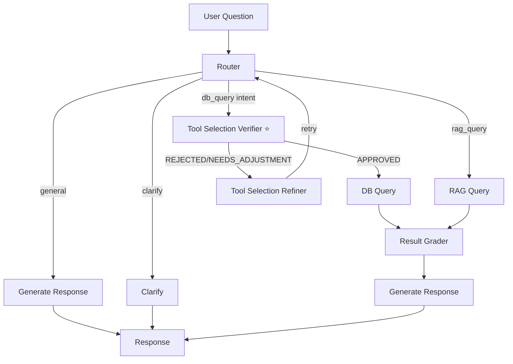

# การ Implement: Tool Selection Verifier (Phase 1)

**วันที่:** 2026-02-12  
**สถานะ:** ✅ Completed

---

## สรุป

ได้ implement **Phase 1: Tool Selection Verifier (Pre-Verification)** สำเร็จแล้ว

### ไฟล์ที่สร้าง/แก้ไข

1. ✅ **`backend/app/orchestrator/nodes/tool_selection_verifier.py`** (NEW)
   - ตรวจสอบ tool selection ก่อนรัน
   - ใช้ LLM เพื่อตรวจสอบความเหมาะสมของ tools และ parameters
   - Return: `APPROVED`, `REJECTED`, หรือ `NEEDS_ADJUSTMENT`

2. ✅ **`backend/app/orchestrator/nodes/tool_selection_refiner.py`** (NEW)
   - ปรับปรุง tool selection ตาม feedback จาก verifier
   - อัพเดท `selected_tools` และ `tool_parameters`
   - ส่งกลับไปที่ router เพื่อ retry

3. ✅ **`backend/app/utils/system_prompt.py`** (UPDATED)
   - เพิ่ม `get_tool_selection_verifier_prompt()` function
   - System prompt สำหรับ tool selection verifier

4. ✅ **`backend/app/orchestrator/state.py`** (UPDATED)
   - เพิ่ม fields สำหรับ verification:
     - `verification_status`: "APPROVED" | "REJECTED" | "NEEDS_ADJUSTMENT"
     - `verification_reason`: คำอธิบาย
     - `verification_suggested_changes`: คำแนะนำการแก้ไข
     - `verification_retry_count`: จำนวนครั้งที่ retry
     - `max_verification_retries`: จำนวนครั้งสูงสุด (default: 2)

5. ✅ **`backend/app/orchestrator/graph.py`** (UPDATED)
   - เพิ่ม nodes: `tool_selection_verifier`, `tool_selection_refiner`
   - อัพเดท edges:
     - `router` → `tool_selection_verifier` (สำหรับ db_query intent)
     - `tool_selection_verifier` → `db_query` (ถ้า APPROVED)
     - `tool_selection_verifier` → `tool_selection_refiner` (ถ้า REJECTED/NEEDS_ADJUSTMENT)
     - `tool_selection_refiner` → `router` (retry)

---

## Flow ใหม่



---

## การทำงาน

### 1. Router เลือก Tools
- Router วิเคราะห์ intent และเลือก tools
- ส่งไปที่ Tool Selection Verifier (สำหรับ db_query intent)

### 2. Tool Selection Verifier (Pre-Verification)
- ตรวจสอบว่า tools ที่เลือกเหมาะสมกับคำถามหรือไม่
- ตรวจสอบ parameters ถูกต้องหรือไม่
- Return:
  - ✅ **APPROVED**: ไปรัน tools
  - ❌ **REJECTED**: แก้ไข tools ทั้งหมด
  - ⚠️ **NEEDS_ADJUSTMENT**: ปรับปรุง parameters หรือเพิ่ม tools

### 3. Tool Selection Refiner
- รับ feedback จาก verifier
- ปรับปรุง `selected_tools` และ `tool_parameters`
- ส่งกลับไปที่ router เพื่อ retry

### 4. DB Query
- รัน tools ที่ผ่านการตรวจสอบแล้ว
- ไปที่ Result Grader (ตรวจสอบคุณภาพข้อมูล)

---

## ตัวอย่างการทำงาน

### ตัวอย่างที่ 1: Tool Selection ผิด

**คำถาม:** "ยอดขายแยกตามเดือน แยกตามแพลตฟอร์มด้วย"

**Router เลือก:** `search_leads` ❌

**Tool Selection Verifier:**
```json
{
    "status": "REJECTED",
    "reason": "คำถามเกี่ยวกับยอดขายที่ปิดแล้ว ควรใช้ get_sales_closed ไม่ใช่ search_leads",
    "suggested_tools": [
        {
            "name": "get_sales_closed",
            "parameters": {
                "date_from": "2025-11-01",
                "date_to": "2025-11-30"
            }
        }
    ]
}
```

**Tool Selection Refiner:**
- แทนที่ `search_leads` ด้วย `get_sales_closed`
- ส่งกลับไปที่ router

**Router เลือกใหม่:** `get_sales_closed` ✅

**Tool Selection Verifier:**
```json
{
    "status": "APPROVED",
    "reason": "Tool และ parameters ถูกต้อง"
}
```

**→ DB Query**

### ตัวอย่างที่ 2: Parameters ไม่ถูกต้อง

**คำถาม:** "ยอดขายแยกตามเดือน"

**Router เลือก:** `get_sales_closed` with `date_from=2026-01-01`, `date_to=2026-02-12` ⚠️

**Tool Selection Verifier:**
```json
{
    "status": "NEEDS_ADJUSTMENT",
    "reason": "คำถามต้องการแยกรายเดือน ควรเรียก get_sales_closed หลายครั้ง ครั้งละ 1 เดือน",
    "suggested_tools": [
        {
            "name": "get_sales_closed",
            "parameters": {
                "date_from": "2025-11-01",
                "date_to": "2025-11-30"
            }
        },
        {
            "name": "get_sales_closed",
            "parameters": {
                "date_from": "2025-12-01",
                "date_to": "2025-12-31"
            }
        },
        {
            "name": "get_sales_closed",
            "parameters": {
                "date_from": "2026-01-01",
                "date_to": "2026-01-31"
            }
        }
    ]
}
```

**Tool Selection Refiner:**
- แทนที่ tool เดียวด้วย 3 tools (แต่ละเดือน)
- ส่งกลับไปที่ router

**Router เลือกใหม่:** `get_sales_closed` 3 ครั้ง ✅

**Tool Selection Verifier:**
```json
{
    "status": "APPROVED",
    "reason": "Tool selection ถูกต้อง - เรียกหลายครั้งแยกรายเดือน"
}
```

**→ DB Query**

---

## Configuration

### Max Verification Retries
- Default: `max_verification_retries = 2`
- ถ้า retry เกินจำนวนนี้ จะ approve อัตโนมัติเพื่อไม่ให้ blocking

### Temperature
- Verifier ใช้ `temperature=0.3` เพื่อความสม่ำเสมอในการตรวจสอบ

---

## Error Handling

1. **LLM Error**: ถ้า LLM error จะ approve อัตโนมัติ (ไม่ให้ blocking)
2. **JSON Parse Error**: ถ้า parse JSON ไม่ได้ จะ approve อัตโนมัติ
3. **Max Retries**: ถ้า retry เกินจำนวน จะ approve อัตโนมัติ

---

## Testing Checklist

- [ ] Test: Tool selection ถูกต้อง → APPROVED
- [ ] Test: Tool selection ผิด → REJECTED → Refiner → Router retry
- [ ] Test: Parameters ไม่ถูกต้อง → NEEDS_ADJUSTMENT → Refiner → Router retry
- [ ] Test: No tools selected → APPROVED (skip verification)
- [ ] Test: Max retries → APPROVED (auto-approve)
- [ ] Test: LLM error → APPROVED (fallback)

---

## Next Steps (Phase 2)

Phase 2 จะเพิ่ม **Tool Execution Verifier (Post-Verification)**:
- ตรวจสอบผลลัพธ์หลังรัน tools
- ตรวจสอบว่าผลลัพธ์ตอบคำถามได้หรือไม่
- สามารถเพิ่ม tools เพิ่มเติมได้ถ้าข้อมูลไม่ครบ

---

## Files Summary

```
backend/app/orchestrator/
├── nodes/
│   ├── tool_selection_verifier.py      (NEW) ⭐
│   ├── tool_selection_refiner.py      (NEW) ⭐
│   ├── db_query.py
│   ├── result_grader.py
│   └── ...
├── graph.py                            (UPDATED) ⭐
└── state.py                            (UPDATED) ⭐

backend/app/utils/
└── system_prompt.py                    (UPDATED) ⭐
```

---

*อ้างอิง:*
- `docs/TOOL_SELECTION_VERIFICATION_ANALYSIS.md` - การวิเคราะห์แนวทาง
- `docs/TOOL_VERIFICATION_SUMMARY_TH.md` - สรุปภาษาไทย
